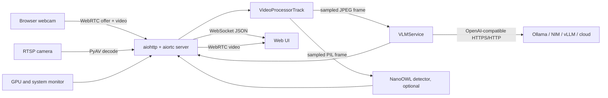

# Live VLM WebUI: System Architecture and Jetson Integration

This document describes the implementation in this repository, its runtime
data flow, supported startup paths, and the steps required to operate it on an
NVIDIA Jetson board.

## 1. System purpose

Live VLM WebUI is a browser-based real-time vision application. A browser or
RTSP camera supplies video; selected frames are sent to an OpenAI-compatible
vision-language model (VLM); results, latency, detections, and hardware
telemetry are returned to the browser.

The WebUI does not host a VLM itself. It connects to a separate backend such as
Ollama, NVIDIA NIM, vLLM, SGLang, or a compatible cloud API.

## 2. Architecture at a glance



The VLM and detector run independently. A slow text response does not stop the
video track, and detector work does not wait for VLM inference.

## 3. Main components

| Component | Responsibility |
| --- | --- |
| `src/live_vlm_webui/static/index.html` | Single-page browser UI, camera capture, WebRTC negotiation, WebSocket control/status, overlays, and settings. |
| `src/live_vlm_webui/server.py` | Application entry point, HTTP routes, WebSocket protocol, WebRTC peer lifecycle, per-session VLM configuration, RTSP lifecycle, TLS, and shutdown. |
| `src/live_vlm_webui/video_processor.py` | Receives frames, tracks latency, samples frames, launches inference tasks, and returns the original video frame. |
| `src/live_vlm_webui/vlm_service.py` | JPEG/base64 encoding and asynchronous OpenAI-compatible chat-completions requests. |
| `src/live_vlm_webui/detector_service.py` | Optional shared NanoOWL open-vocabulary detector and normalized bounding-box output. |
| `src/live_vlm_webui/rtsp_track.py` | PyAV RTSP connection, decode, reconnection, and sanitized logging. |
| `src/live_vlm_webui/gpu_monitor.py` | NVML, Jetson `jtop`, Apple Silicon, CPU, RAM, temperature, and power telemetry. |
| `docker/docker-compose.yml` | Ollama/NIM plus WebUI service definitions for desktop, Orin, and Thor. |
| `scripts/common.sh` | Shared project-path, platform, Docker, Compose, and access-address helpers. |

## 4. Protocols and routes

The aiohttp application exposes:

| Route | Purpose |
| --- | --- |
| `GET /` | Load the WebUI. |
| `GET /images/*`, `GET /favicon/*` | Packaged static assets. |
| `GET /models` | Query models from the configured OpenAI-compatible backend. |
| `GET /detect-services` | Probe supported local VLM services. |
| `GET /ws?session_id=...` | Bidirectional configuration, results, detections, and telemetry. |
| `POST /offer` | Exchange a WebRTC SDP offer for an answer. |
| `POST /api/rtsp/start` | Start server-side RTSP analysis. |
| `POST /api/rtsp/stop` | Stop an RTSP analysis session. |
| `GET /api/rtsp/status` | Report active RTSP sessions. |

The WebSocket handles prompt, model/API, frame interval, latency, debug-payload,
and detector configuration messages. VLM settings are stored per session.
NanoOWL is intentionally one shared model to avoid duplicating GPU memory, so
its query and latest detections are process-wide rather than session-isolated.

## 5. Frame-processing lifecycle

1. The browser sends a webcam track through WebRTC, or the server decodes RTSP
   through PyAV.
2. `VideoProcessorTrack.recv()` receives the next `VideoFrame`.
3. The original frame is returned to WebRTC without an encode/decode round trip.
4. Only frames due for VLM or detector work are converted from YUV to BGR/PIL.
5. VLM sampling defaults to every 30 frames; Jetson Compose defaults to 45.
6. NanoOWL sampling defaults to every 10 frames when a detection query is set.
7. Each service has an in-flight lock. If it is busy, the new sampled frame is
   dropped rather than queued, preventing unbounded latency.
8. The VLM response and metrics are pushed to the session's WebSocket. The UI
   draws normalized detector boxes over the video.

RTSP demux/decode and NanoOWL inference use executor threads so blocking native
operations do not block aiohttp's event loop. RTSP reconnects with exponential
backoff after transient decode or network failures.

## 6. Startup architecture

### Local Linux or WSL2

Canonical entry point:

```bash
./scripts/start_wsl.sh [server options]
```

`start_wsl.sh` delegates to `start_server.sh`, which:

1. enters the repository root regardless of the caller's current directory;
2. selects `.venv`, `venv`, an active virtualenv, or Conda;
3. prefers the project `.venv` when it contains NanoOWL/Torch and the active
   environment does not;
4. verifies that `live_vlm_webui` imports;
5. reports optional NanoOWL/CUDA availability;
6. launches `python -m live_vlm_webui.server` with all caller arguments intact.

The Python entry point is the single source of truth for host/port validation
and TLS. It stores generated certificates under the OS configuration directory,
fails clearly when a fixed port is occupied, and supports `--auto-port`.

From Windows PowerShell, the wrapper safely passes arguments into WSL:

```powershell
.\scripts\start_windows.ps1 --port 8091 --auto-port
```

Stop with `./scripts/stop_wsl.sh` or `.\scripts\stop_windows.ps1`.

### Jetson

Canonical entry point:

```bash
./scripts/start_jetson.sh [--model MODEL]
```

The launcher:

1. reads L4T from `/etc/nv_tegra_release` (R36 selects Orin; R38+ selects Thor);
2. verifies Docker daemon access and warns about missing NVIDIA runtime or
   `/run/jtop.sock`;
3. selects `ollama-jetson-orin` or `ollama-jetson-thor`;
4. sets conservative embedded defaults (`LIVE_VLM_PROCESS_EVERY=45`, one BLAS
   and OpenMP thread, and CUDA for NanoOWL when present);
5. sets the WebUI API/model to the local Ollama service even when its model
   volume is initially empty;
6. starts the Compose stack in detached mode.

The launcher deliberately does not block on a multi-gigabyte model download.
After first start, run the printed command, for example:

```bash
docker exec ollama ollama pull llama3.2-vision:11b
```

Stop with `./scripts/stop_jetson.sh`. Add `--volumes` only when intentionally
removing the Ollama model volume as well.

The older `start_container.sh`, `stop_container.sh`, and
`jetson_quickstart.sh` scripts are compatibility shims that route to the
canonical Compose/Jetson launchers.

## 7. Configuration reference

Important server arguments:

| Option | Default | Meaning |
| --- | --- | --- |
| `--host` | `0.0.0.0` | Listening interface. |
| `--port` | `8090` | HTTPS/HTTP listening port. |
| `--auto-port` | off | Select the next free port if the requested port is occupied. |
| `--model` | detected | VLM model identifier. |
| `--api-base` | detected | OpenAI-compatible `/v1` base URL. |
| `--api-key` | `EMPTY` | API credential for remote providers. |
| `--process-every` | `30` | Send every Nth frame to the VLM. |
| `--ssl-cert`, `--ssl-key` | config directory | Custom TLS files. |
| `--no-ssl` | off | Disable TLS; browser webcam access may then fail. |

Important environment variables:

| Variable | Purpose |
| --- | --- |
| `LIVE_VLM_API_BASE` | Default backend URL when CLI does not override it. |
| `LIVE_VLM_DEFAULT_MODEL` | Default backend model. |
| `LIVE_VLM_PROCESS_EVERY` | Frame sampling interval. |
| `NANOOWL_DEVICE` | Detector device, normally `cuda` or `cpu`. |
| `NANOOWL_IMAGE_ENCODER_ENGINE` | Optional TensorRT engine file for NanoOWL. |
| `NGC_API_KEY` | Required by the NIM Compose profiles. |

## 8. Jetson installation

### Prerequisites

- Jetson Orin with JetPack 6 / L4T R36, or Jetson Thor with JetPack 7 / L4T R38+
- Docker and Docker Compose v2
- NVIDIA Container Toolkit/runtime
- Sufficient storage for images and the selected model
- `jetson-stats`/`jtop` on the host for full telemetry (optional)

Verify the board before deployment:

```bash
cat /etc/nv_tegra_release
docker version
docker compose version
docker info | grep -i nvidia
```

If the NVIDIA runtime is absent:

```bash
sudo nvidia-ctk runtime configure --runtime=docker
sudo systemctl restart docker
```

Install telemetry if desired, then reboot or restart its service as instructed
by `jetson-stats`:

```bash
sudo pip3 install -U jetson-stats
```

### Deploy and verify

```bash
git clone https://github.com/nvidia-ai-iot/live-vlm-webui.git
cd live-vlm-webui
./scripts/start_jetson.sh
docker exec ollama ollama pull llama3.2-vision:11b
docker compose -f docker/docker-compose.yml logs -f
```

Open `https://<jetson-ip>:8090`, accept the self-signed certificate once, and
allow camera access. Verify:

1. the header reports WebSocket connected;
2. `/models` or the model refresh button lists the pulled Ollama model;
3. starting analysis produces text and latency updates;
4. GPU/CPU/RAM values update (full Jetson telemetry requires `/run/jtop.sock`);
5. `docker ps` reports both `ollama` and `live-vlm-webui` healthy/running.

For RTSP, use a URL reachable from the Jetson itself. Credentials are redacted
from logs, but remain part of runtime configuration.

## 9. NanoOWL on Jetson

NanoOWL is optional and fails open: if its imports, model weights, or CUDA
runtime are unavailable, the WebUI remains functional and reports that object
detection is disabled.

The current published WebUI Dockerfiles install `jetson-stats` but do **not**
install NanoOWL, PyTorch, torchvision, transformers, or a TensorRT encoder
engine. Therefore setting `NANOOWL_DEVICE=cuda` alone does not enable bounding
boxes in those images. A detector-enabled custom Jetson image must install a
JetPack-compatible PyTorch stack, install the sibling `nanoowl` package and its
dependencies, and optionally build/mount an engine through
`NANOOWL_IMAGE_ENCODER_ENGINE`. TensorRT engines are hardware/software-specific
and should be built on the target Jetson software stack.

Without an engine, NanoOWL uses its PyTorch path and is slower. The startup
script's `scripts/check_nanoowl.py` reports the effective availability before
local startup.

## 10. Operations and security boundaries

- HTTPS uses a self-signed certificate. Replace it with a trusted certificate
  when deploying beyond a lab environment.
- The server has no authentication or authorization. Binding to `0.0.0.0`
  exposes model configuration, RTSP controls, and debug payloads to reachable
  clients. Keep it on a trusted network or place it behind an authenticated
  reverse proxy/firewall.
- STUN uses public Google endpoints for WebRTC NAT discovery; restricted or
  offline networks may require a local STUN/TURN configuration.
- The default Compose services use host networking for the WebUI and privileged
  mode on Jetson. Treat the container as trusted code and minimize host exposure.
- NIM on Jetson depends on the exact image architecture, JetPack/CUDA version,
  available unified memory, and NIM model support. The Ollama Jetson path is the
  default supported launcher path in this repository.
- VLM API errors are returned as UI text so the video pipeline continues.
- Graceful shutdown cancels telemetry and RTSP tasks, closes WebSockets and peer
  connections, and releases the Jetson monitor connection.

## 11. Validation scope

Repository validation covers shell syntax, server port-selection regression
tests, the real aiohttp index/static routes, an actual WebSocket handshake, GPU
monitor factory behavior, and performance smoke tests. Hardware-dependent
checks still must be run on the target board: NVIDIA runtime access, Ollama/NIM
GPU execution, `jtop` socket data, camera WebRTC negotiation, RTSP reachability,
and any custom NanoOWL/TensorRT image.
